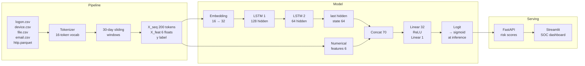

# Insider Threat LSTM

Dual-input LSTM that detects insider threats in enterprise user activity logs using the CERT r4.2 dataset.

---

## Results

Trained for 21 epochs on a Colab T4 GPU. **10 of 11 test-set threat users detected, on average 174 days before their labeled threat start date.**

| Metric | Value |
|---|---|
| Val PR-AUC | 0.4504 |
| Val ROC-AUC | 0.9631 |
| Test PR-AUC | 0.1707 |
| Test ROC-AUC | 0.9414 |
| Recall @ 0.5 | 53.97% |
| Precision @ 0.5 | 11.95% |
| F1 @ 0.7 (best) | 0.2053 |
| Threat users detected | **10 / 11** |
| Avg days before threat start | **174** |

Class balance in test set: 630 positives / 68,023 negatives (0.92%). Low precision is expected — see [Why PR-AUC](#why-pr-auc-over-roc-auc).

### Per-threat-user detection (test set)

| User | Detected | Alerts | First Alert | Days Before |
|---|---|---|---|---|
| BLS0678 | ✅ | 2 | 2010-08-23 | +29 |
| CCA0046 | ✅ | 104 | 2010-01-04 | +283 |
| CCL0068 | ✅ | 366 | 2010-01-04 | +357 |
| CEJ0109 | ✅ | 455 | 2010-01-04 | +399 |
| JJM0203 | ✅ | 32 | 2010-01-10 | +235 |
| KRL0501 | ✅ | 367 | 2010-01-04 | +322 |
| LJR0523 | ✅ | 21 | 2010-06-30 | +31 |
| MCF0600 | ✅ | 21 | 2010-08-22 | +29 |
| MSO0222 | ✅ | 30 | 2010-11-10 | +29 |
| TAP0551 | ✅ | 23 | 2010-09-23 | +30 |
| TNM0961 | ❌ | 0 | — | — |

---

## Architecture

### System overview



### Dual-input model detail

```
seq_input  (batch, 200)  ──► Embedding(16, 32)
                              │
                          (batch, 200, 32)
                              │
                          LSTM₁  hidden=128, dropout=0.3
                              │
                          (batch, 200, 128)
                              │
                          LSTM₂  hidden=64, dropout=0.3
                              │
                          output[:, -1, :]  ← last hidden state only
                              │
                          (batch, 64)
                              │
feat_input (batch, 6)  ───► cat ──► (batch, 70)
                                       │
                                   Linear(70→32) → ReLU → Dropout(0.2)
                                       │
                                   Linear(32→1)
                                       │
                                   raw logit  (sigmoid at inference only)
```

**Total parameters: ~135K.** BCEWithLogitsLoss with `pos_weight` capped at 20× for class imbalance.

---

## Dataset

**CERT Insider Threat Dataset r4.2** — a synthetic enterprise dataset of ~1,000 users over 18 months with deliberately embedded insider threat scenarios.

| Source | Events | Description |
|---|---|---|
| `logon.csv` | ~500K | Login/logoff with timestamps |
| `device.csv` | ~80K | USB connect/disconnect |
| `file.csv` | ~450K | File copies to removable media |
| `email.csv` | ~1.1M | Internal/external email with attachments |
| `http.csv` | ~2.8M | Web browsing with URLs |

**Ground truth:** `answers/insiders.csv` — 70 threat users (dataset 4.2) with labeled start/end dates.

**Windowing:** 30-day sliding window, 1-day step → 464,687 total windows across 1,000 users.

**Split:** user-level 70/15/15, stratified to preserve threat user ratio.

### Event vocabulary (16 tokens)

| Token | ID | Condition |
|---|---|---|
| UNKNOWN | 0 | Default fallback |
| NORMAL\_LOGIN | 1 | Logon, business hours, weekday |
| AFTERHOURS\_LOGIN | 2 | Logon, hour < 7 or > 18 |
| WEEKEND\_LOGIN | 3 | Logon, Saturday or Sunday |
| LOGOFF | 4 | Logoff activity |
| USB\_CONNECT | 5 | Device connect |
| USB\_DISCONNECT | 6 | Device disconnect |
| FILE\_OPEN | 7 | Reserved |
| FILE\_COPY | 8 | Any file.csv event |
| LARGE\_FILE\_ACTIVITY | 9 | Reserved |
| HTTP\_NORMAL | 10 | Generic web browsing |
| HTTP\_JOBSITE | 11 | linkedin, indeed, glassdoor, monster, careerbuilder |
| HTTP\_CLOUD\_STORAGE | 12 | dropbox, drive.google, onedrive, box.com, wetransfer |
| EMAIL\_NORMAL | 13 | Internal email, no attachment |
| EMAIL\_WITH\_ATTACHMENT | 14 | Internal email with attachment |
| EMAIL\_EXTERNAL | 15 | Any recipient outside @dtaa.com |

### Numerical features (6)

| Feature | Description |
|---|---|
| `avg_hour` | Mean event hour across window |
| `after_hours_ratio` | Fraction of events outside 07:00–18:00 |
| `weekend_ratio` | Fraction of events on Sat/Sun |
| `usb_count` | Raw count of USB connect/disconnect events |
| `email_external_ratio` | External emails / total emails |
| `http_jobsite_ratio` | Job-site visits / total HTTP events |

---

## Why PR-AUC over ROC-AUC

ROC-AUC looks excellent here (0.94) because it measures performance across all thresholds relative to the true negative rate — and with 98.9% of windows being benign, a model can achieve high ROC-AUC while producing floods of false positives in practice.

**PR-AUC (0.17) is the honest number.** It directly measures the precision-recall trade-off on the minority class. A random classifier on this dataset would score PR-AUC ≈ 0.009 (the base rate), so 0.17 represents roughly 18× improvement over chance — but also the real cost of operating this system: at threshold=0.5, for every true alert there are ~7 false positives. The threshold sweep lets an operator choose their operating point.

---

## Tech stack

| Component | Technology |
|---|---|
| Model | PyTorch 2.x |
| Data pipeline | pandas, NumPy, PyArrow |
| Training | Google Colab T4 (15 GB VRAM) |
| Experiment tracking | MLflow + Weights & Biases |
| Serving API | FastAPI + Uvicorn |
| SOC dashboard | Streamlit + Plotly |

---

## Setup

```bash
git clone https://github.com/Saksham-3175/insider-threat-lstm
cd insider-threat-lstm

source ~/Code/ml-venv/bin/activate   # or your venv
pip install -r requirements.txt

# Place CERT r4.2 dataset at data/r4.2/
```

---

## How to run

### 1 — Data pipeline (local, ~30–60 min)

```bash
python src/pipeline.py
```

Converts `http.csv` to Parquet, tokenizes all events, builds sliding windows, saves `.npy` arrays to `outputs/`.

### 2 — Train (Google Colab T4)

Upload `outputs/*.npy` to Google Drive, open `notebooks/train_colab.py` in Colab, set `DRIVE_DIR`, connect a T4 runtime, run all cells. Downloads `best_model.pt` to `outputs/` when done.

### 3 — Evaluate (local)

```bash
python src/evaluate.py
```

Runs full evaluation: metrics, confusion matrix, PR/ROC curves, per-user threat detection analysis, time-to-detection chart. Results saved to `outputs/evaluation_results.json`.

### 4 — Serve

```bash
# Terminal 1 — REST API
uvicorn serving.api:app --reload --port 8000

# Terminal 2 — SOC dashboard
streamlit run serving/app.py
```

API precomputes risk scores for all test users at startup (~30s). Dashboard available at `http://localhost:8501`.

---

## Experiment tracking

**Weights & Biases dashboard:** `<!-- INSERT YOUR WANDB RUN URL HERE -->`

Tracked per epoch: train/val loss, PR-AUC, ROC-AUC, learning rate. Best model saved on val PR-AUC improvement.

---

## Future work

- **Attention over the LSTM sequence** — replace `output[:, -1, :]` with a learned attention pooling over all 200 hidden states. Should improve recall on users with sparse but highly anomalous events buried in the window.

- **Focal loss** — replace BCEWithLogitsLoss with focal loss (γ=2) to down-weight easy negatives. More principled than `pos_weight` capping and may improve PR-AUC directly.

- **Transformer encoder** — replace the 2-layer LSTM with a small Transformer (4 heads, 2 layers) on the token sequence. Positional encoding over the 200-token window captures long-range co-occurrence patterns (e.g., USB activity correlated with job-site browsing weeks earlier).

- **User baseline subtraction** — compute rolling per-user behavioral baselines and feed deviation features instead of raw ratios. The model currently learns absolute patterns; anomaly detection benefits from relative deviation.

- **Multi-label scenarios** — the CERT dataset includes multiple distinct threat scenarios (data exfiltration, sabotage, IP theft). Training separate heads or using a multi-task objective could improve scenario-level attribution.

---

## References

- Glasser, J., & Lindauer, B. (2013). *Bridging the gap: A pragmatic approach to generating insider threat data*. IEEE S&P Workshops.
- CERT Division. *CERT Insider Threat Dataset r4.2*. Carnegie Mellon University SEI.
- Hochreiter, S., & Schmidhuber, J. (1997). *Long Short-Term Memory*. Neural Computation, 9(8).
- Davis, J., & Goadrich, M. (2006). *The relationship between precision-recall and ROC curves*. ICML.
- Lin, T.-Y., et al. (2017). *Focal loss for dense object detection*. ICCV.
